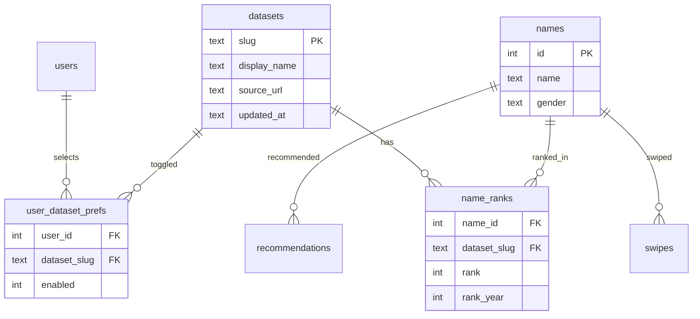
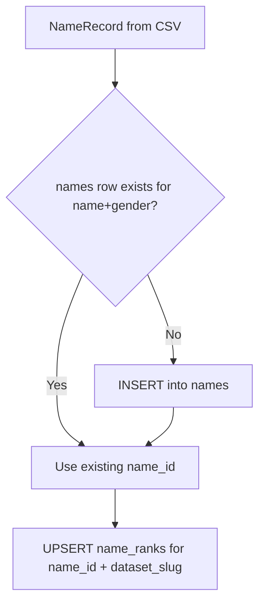

# Multi-dataset baby names architecture

> **Status: parked** — not ready to implement yet. Resume from this doc when ready.

## Recommendation vs. tagging each row with "England & Wales"

A plain `source` column on `names` works for labeling but breaks down once the same spelling appears in multiple countries with **different ranks**, and it would force duplicate swipe rows for the same name.

**Recommended model (confirmed):** keep one canonical name per `(name, gender)` in `names`. Store which countries/lists each name appears in — and its rank there — in a **separate junction table** (`name_ranks`). The user never sees the same name twice in the deck, even if it appears in England & Wales and Scotland. Gender still splits entries: `James` (M) and `James` (F) remain two distinct cards if both exist.



| Approach | Pros | Cons |
|----------|------|------|
| **String on each row** (`source = "England & Wales"`) | Simple to read | Same name in 2 countries = 2 rows, 2 swipes; rank ambiguity |
| **Normalized datasets + ranks (recommended)** | One swipe per name; different ranks per country; easy to add sources | Slightly more SQL in queries |

Display names: use slugs internally (`england-wales`, `scotland`, `northern-ireland`) and human labels in UI ("England & Wales", etc.).

### Deduplication rules

| Scenario | Behaviour |
|----------|-----------|
| `Olivia` in England & Wales **and** Scotland (both F) | **One card.** Single `names` row; two `name_ranks` rows (one per dataset). |
| `James` (M) and `James` (F) in the same dataset | **Two cards.** `UNIQUE (name, gender)` on `names`. |
| User has 2 datasets enabled, name in both | **One card**, ranked by `MIN(rank)` across active datasets. |
| User disables Scotland, name only in Scotland | **Hidden** from deck/search until Scotland is re-enabled. |
| User swipes `Olivia` | Swipe applies to the canonical `name_id` — not per-country. Matches work regardless of which dataset(s) were active when they swiped. |

The swipe deck, search, and recommend lookup all query **`names` grouped by id**, never raw per-dataset rows.

---

## Annual updates are data imports, not schema migrations

Your ONS importer already reads multi-year columns and picks the **latest year with a value** ([`scripts/import_csv.py`](scripts/import_csv.py) `rank_columns` + `row_rank`). Scotland and NI likely follow a similar pattern.

**Annual workflow per dataset:**
1. Download the new year's spreadsheet from the official source.
2. Run `import_dataset --dataset scotland --gender M path.csv`.
3. Importer upserts `name_ranks` for that dataset, updating `rank`, `rank_year`, and `datasets.updated_at`.

No DB schema migration is needed unless a source changes column layout — only a new **adapter** if the format changes structurally.

---

## Separate names API: phased, not now

With 3 sources and a single self-hosted deployment, splitting into a second service now adds Docker networking, auth, and deployment overhead without much benefit.

**Phase 1 (this work):** Extract a clear Python boundary inside the repo:

```
names/
  catalog.py      # queries: search, random, datasets list
  schema.py       # datasets / name_ranks migrations
  importers/
    base.py       # NameRecord dataclass + shared helpers
    ons_england_wales.py   # refactor from import_csv.py
    nrs_scotland.py        # new, once sample CSV provided
    nisra_northern_ireland.py
scripts/import_dataset.py  # CLI entry point
```

[`app/main.py`](app/main.py) calls `names.catalog` instead of inline SQL. Same SQLite file for now.

**Phase 2 (later):** Move `names/` into its own FastAPI app + `names.db` (or keep shared volume). Kinder becomes a client. The catalog function signatures become HTTP endpoints (`GET /datasets`, `GET /names/search`, `GET /names/next`). Swipes stay in Kinder's DB referencing stable `name_id`s.

---

## Schema migration (one-time)

Add to [`app/database.py`](app/database.py) following existing `_migrate_*` pattern:

1. **`datasets`** — seed rows:

   | slug | display_name |
   |------|--------------|
   | `england-wales` | England & Wales |
   | `scotland` | Scotland |
   | `northern-ireland` | Northern Ireland |

2. **`name_ranks`** (origin/country reference table) — links a canonical name to each dataset it appears in:
   - `(name_id, dataset_slug, rank, rank_year)`
   - `UNIQUE(name_id, dataset_slug)` — a name can only have one rank per country
   - This is where origin is stored; **`names` has no country column**

3. **`user_dataset_prefs`** — `(user_id, dataset_slug, enabled)` default all enabled for existing users.

4. **Migrate existing data:**
   - Insert all current [`names`](app/database.py) rows into `name_ranks` with `dataset_slug = 'england-wales'`.
   - Set `rank_year` from the latest year column used during import (store during import going forward).
   - Drop `names.rank` column (SQLite rebuild) or leave deprecated and stop using it.

5. **Relax unique constraint** on `names` stays `(name, gender)` — one canonical row per spelling/gender.

---

## Importer design (different schemas)

Shared output type regardless of source CSV shape:

```python
@dataclass
class NameRecord:
    name: str
    gender: str  # M | F
    rank: int
    rank_year: int
```

Each adapter implements `load(path: Path, gender: str) -> list[NameRecord]`. Adapters only parse CSV → `NameRecord`; they do not touch the DB.

- **`ons_england_wales`** — extract existing logic from [`scripts/import_csv.py`](scripts/import_csv.py) (header row scan, `"2024 rank"` columns, title-case).
- **`nrs_scotland`** / **`nisra_northern_ireland`** — implement after you drop sample files into [`sample-data/`](sample-data/). The plan assumes separate boys/girls files or a combined file; adapter handles whichever format you have.

### Import upsert flow (deduplication at write time)

For each `NameRecord` from the adapter:



1. **Within a single CSV:** dedupe by name, keep best (lowest) rank — same as today.
2. **Across datasets:** `INSERT INTO names ... ON CONFLICT(name, gender) DO NOTHING` then `SELECT id`; never create a second `names` row for the same spelling + gender.
3. **Origin link:** `INSERT INTO name_ranks (name_id, dataset_slug, rank, rank_year) ON CONFLICT(name_id, dataset_slug) DO UPDATE SET rank = ..., rank_year = ...`.

CLI:

```bash
python scripts/import_dataset.py --dataset england-wales F /sample-data/ons-girls.csv
python scripts/import_dataset.py --dataset scotland M /sample-data/scotland-boys.csv
```

Import order does not matter — Scotland can be imported before or after England & Wales; shared names automatically share one `name_id`.

Update [`docker-compose.yml`](docker-compose.yml) import profile to one service per dataset (or a single `import-all` script).

---

## API and query changes

New endpoints in [`app/main.py`](app/main.py):

- `GET /api/datasets` — list datasets with `enabled` flag for current user.
- `PUT /api/datasets` — save per-user toggles (stored in DB per account).

Update existing endpoints to respect active datasets:

- `GET /api/next-name?user_id=` — join `name_ranks` where `dataset_slug IN (user's enabled datasets)`; order by `MIN(rank)` when multiple datasets enabled.
- `GET /api/names/search?q=` — same filter + rank ordering.
- `GET /api/likes`, `/api/matches` — unchanged (swipes reference `name_id`, not dataset).

Helper used everywhere:

```sql
-- enabled datasets for user
WITH active AS (SELECT dataset_slug FROM user_dataset_prefs WHERE user_id = ? AND enabled = 1)
SELECT n.*, MIN(nr.rank) AS rank
FROM names n
JOIN name_ranks nr ON nr.name_id = n.id AND nr.dataset_slug IN (SELECT dataset_slug FROM active)
GROUP BY n.id
```

On first login / migration, seed `user_dataset_prefs` with all 3 datasets enabled.

---

## Frontend ([`frontend/app.js`](frontend/app.js), [`frontend/index.html`](frontend/index.html))

Add a **Datasets** section in Settings (alongside surname preview):

- Fetch `GET /api/datasets` on load.
- Toggle switches per dataset; on change, `PUT /api/datasets`.
- Deck and search automatically use server-side filtering (no client-side rank logic).

Show optional subtitle on name cards: e.g. "Popular in Scotland" when only one dataset is active, or omit when multiple are on (rank is already blended via `MIN(rank)`).

---

## Implementation order


1. Schema migration + backfill existing names as `england-wales`.
2. Refactor importer into `names/importers/` + `import_dataset.py`.
3. Extract catalog queries; update all `FROM names` usages in [`app/main.py`](app/main.py).
4. Add dataset API + `user_dataset_prefs`.
5. Settings UI toggles.
6. Implement Scotland / NI adapters once sample CSVs are available.
7. Update [`README.md`](README.md) with import instructions per country and annual refresh steps.

---

## What you need to provide

Before Scotland and NI adapters can be written, add **one boys and one girls sample CSV** (or whatever file structure each source publishes) to `sample-data/`. The ONS England & Wales format is already handled.

---

## Files touched (primary)

| File | Change |
|------|--------|
| [`app/database.py`](app/database.py) | New tables, one-time migration from `names.rank` |
| [`names/catalog.py`](names/catalog.py) | New — filtered search/random queries |
| [`names/importers/*.py`](names/importers/) | New — one adapter per source |
| [`scripts/import_dataset.py`](scripts/import_dataset.py) | New CLI replacing/augmenting `import_csv.py` |
| [`app/main.py`](app/main.py) | Dataset endpoints; filter all name queries |
| [`frontend/app.js`](frontend/app.js), [`frontend/index.html`](frontend/index.html) | Settings toggles |
| [`docker-compose.yml`](docker-compose.yml) | Import services per dataset |
