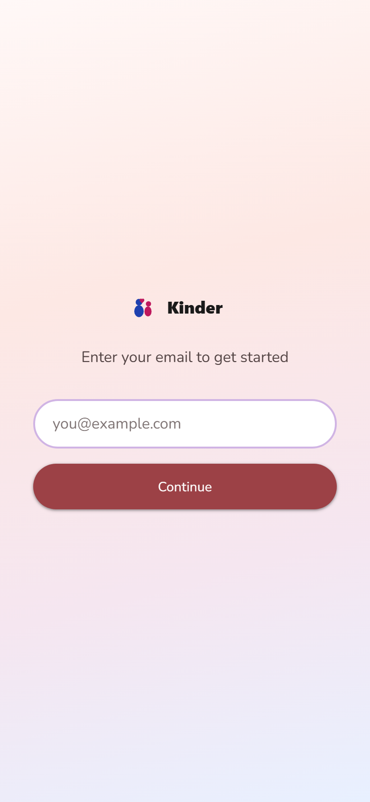
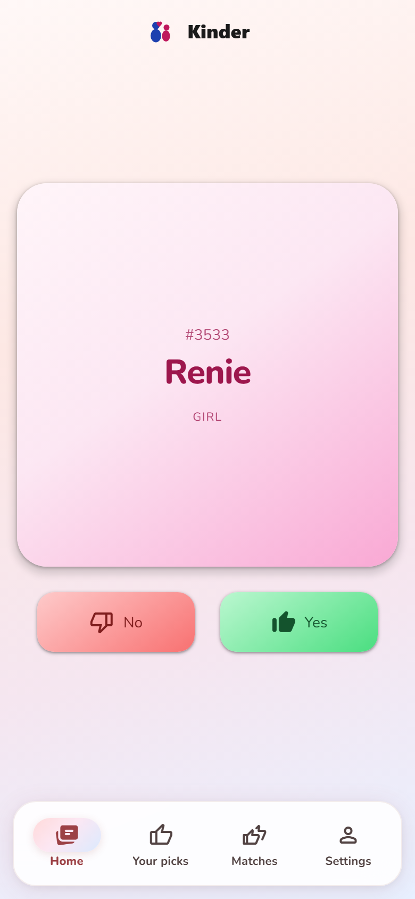
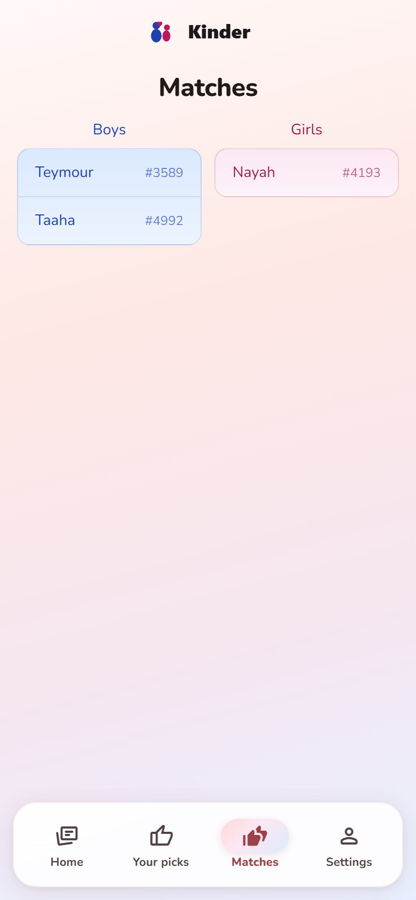

# Kinder

Kinder is a self-hosted web app for couples choosing a baby name together. Swipe through ranked names, invite your partner with a link, and see which names you both love.



## How it works

1. **Sign in** with your email — no password needed.
2. **Swipe** right on names you like and left on ones you don't.
3. **Invite your partner** from Settings and share the link.
4. **View matches** when you both liked the same name.





## Install

You need [Docker](https://docs.docker.com/get-docker/) and Docker Compose.

```bash
git clone https://github.com/BenRutlandWeb/kinder.git
cd kinder
docker compose up --build
```

Open [http://localhost:8487](http://localhost:8487).

On first start, Kinder creates a local database and loads baby names from the bundled UK ONS sample data.

## Use

- **Sign in** — enter your email on the welcome screen.
- **Swipe** — use the Yes / No buttons (or swipe the card on mobile).
- **Your picks** — review every name you liked.
- **Invite partner** — go to Settings → Share invite link, then send it to your partner.
- **Matches** — once you're linked, names you both liked appear on the Matches tab.

Optional in Settings: add your display name, a surname preview on cards, or clear your picks.

## Configuration

Set these in a `.env` file next to `docker-compose.yml` if you need to change defaults:

| Variable | Default | Description |
|----------|---------|-------------|
| `BASE_URL` | `http://localhost:8487` | Public URL used in partner invite links |

If you host Kinder behind a reverse proxy or tunnel, set `BASE_URL` to the URL people actually visit (e.g. `https://names.example.com`), then restart:

```bash
docker compose up -d
```

## Data

Baby names come from [UK ONS baby name statistics](https://www.gov.uk/government/statistics/baby-names-in-england-and-wales) (England and Wales). Your swipes, accounts, and matches stay in a local SQLite database under `data/` on your machine.

To reset user data but keep the name list:

```bash
docker compose run --rm babynames python scripts/strip_user_data.py
```

## License

Add your license here if applicable.
